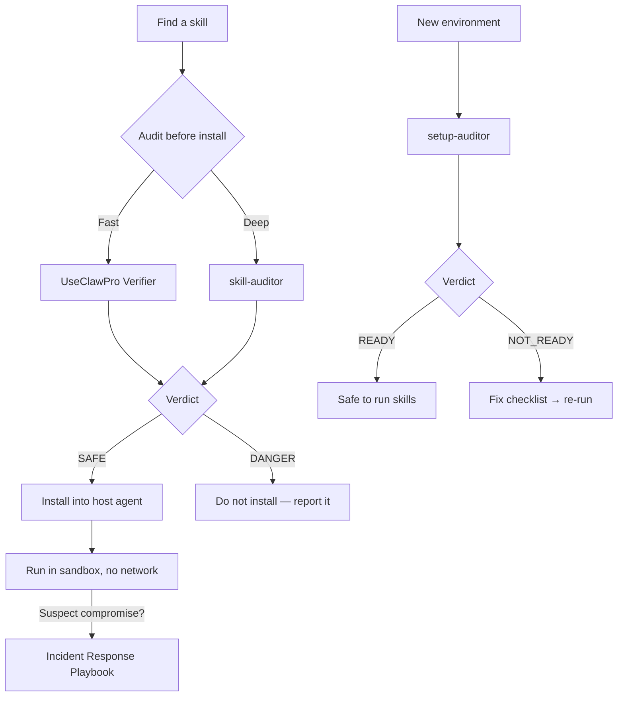

# openclaw-skills-security

Security-first skills for the **OpenClaw** ecosystem — maintained by **UseClawPro** (UseAI.pro).

Two auditor skills for end-users, plus 11 reusable modules (advanced checks).

| Job | Skill | What it does |
|-----|-------|-------------|
| **Audit a skill** | `skill-auditor` | Vet any SKILL.md before install (typosquatting, permissions, prompt injection, supply chain, exfiltration) |
| **Audit your setup** | `setup-auditor` | Check your environment for credential leaks, unsafe defaults, missing sandbox (wizard-style) |

These are **instruction modules** (`SKILL.md`) — they don't run on their own. Load them into a host agent (Codex CLI / Claude Code / OpenClaw) or paste into any LLM chat.

Quick links:
- UseClawPro security hub: https://useclaw.pro/
- Pillar guide: https://useclaw.pro/guides/openclaw-security/
- Skill Verifier (browser): https://useclaw.pro/verifier/
- Verified Skills (catalog): https://useclaw.pro/verified-skills/

## Quickstart

### Job 1 — Audit a skill before installing

**Fast (browser):** paste the skill URL/name into [UseClawPro Verifier](https://useclaw.pro/verifier/).

**Deep (agent):** load `skill-auditor` and give it the target:

```
1) Paste skills/skill-auditor/SKILL.md into your agent
2) Paste the target skill's SKILL.md
3) Ask: "Audit this skill. Return a SKILL AUDIT REPORT."
```

The auditor runs a 6-step protocol: metadata & typosquat check → permission analysis → dependency audit → prompt injection scan → network & exfiltration analysis → content red flags.

Verdict: **SAFE / SUSPICIOUS / DANGEROUS / BLOCK**.

### Job 2 — Audit your environment

Load `setup-auditor` and answer 5 wizard questions about your workspace:

```
1) Paste skills/setup-auditor/SKILL.md into your agent
2) Answer the wizard: workspace path, host agent, permissions, sandbox, ports
3) Get a SETUP AUDIT REPORT with a fix checklist
```

The auditor runs a 4-step protocol: credential scan → config audit → sandbox readiness → persistence check.

Verdict: **READY / RISKY / NOT_READY**.

### Install into your host agent

- **Codex CLI (global):** `ln -s "$PWD/skills/skill-auditor" ~/.codex/skills/skill-auditor` and `ln -s "$PWD/skills/setup-auditor" ~/.codex/skills/setup-auditor`
- **Claude Code (project):** `ln -s "$PWD/skills/skill-auditor" .claude/skills/skill-auditor` and `ln -s "$PWD/skills/setup-auditor" .claude/skills/setup-auditor`
- **No tooling:** just paste the SKILL.md content into your LLM chat.

Modules are optional: you usually don't need to install them separately.

## Threat coverage

Both auditors together cover **12/12 real-world attack types** observed in the wild (including the ClawHavoc campaign):

| # | Attack type | skill-auditor | setup-auditor |
|---|------------|:---:|:---:|
| T1 | Typosquatting | **primary** | |
| T2 | Credential theft | | **primary** |
| T3 | Crypto miners | | **primary** |
| T4 | Reverse shells | **primary** | yes |
| T5 | Prompt injection | **primary** | |
| T6 | Skill loader exploits | **primary** | yes |
| T7 | Obfuscated commands | yes | |
| T8 | Supply chain attack | **primary** | |
| T9 | Social engineering | yes | |
| T10 | Persistence | | **primary** |
| T11 | Over-privilege | **primary** | yes |
| T12 | Data exfiltration | **primary** | yes |

Full evidence: [docs/threat-coverage-matrix.md](docs/threat-coverage-matrix.md)

## Flow



## What's inside

```
skills/
  skill-auditor/SKILL.md    — Job 1: vet any skill (6-step protocol)
  setup-auditor/SKILL.md    — Job 2: audit your environment (wizard + 4-step)
  config-hardener/SKILL.md  — module: harden OpenClaw config
  credential-scanner/SKILL.md — module: scan workspace for leaked secrets
  dependency-auditor/SKILL.md — module: supply chain / install hooks
  incident-responder/SKILL.md — module: post-incident playbook (contain → rotate → recover)
  network-watcher/SKILL.md  — module: network/exfil checks
  output-sanitizer/SKILL.md — module: redact secrets/PII from agent output
  permission-auditor/SKILL.md — module: permission fit + dangerous combos
  prompt-guard/SKILL.md     — module: prompt injection detection
  sandbox-guard/SKILL.md    — module: Docker sandbox profiles
  skill-guard/SKILL.md      — module: runtime monitoring checklist
  skill-vetter/SKILL.md     — module: legacy “deep audit” checklist

docs/
  threat-coverage-matrix.md — evidence: which checks catch which attacks
  config-hardening-checklist.md — minimum security baseline
  incident-response-playbook.md — what to do if compromised
```

## What it checks (and what it doesn't)

**skill-auditor** checks:
- Typosquatting & naming anomalies
- Permission combinations (`network` + `shell` = critical)
- Dependency supply chain (install hooks, obfuscation, recent publish)
- Prompt injection patterns (role hijacking, hidden instructions)
- Network exfiltration (suspicious endpoints, DNS tunneling, data in headers)
- Content red flags (credential paths, encoded commands, sudo)

**setup-auditor** checks:
- Exposed secrets in workspace (`.env`, keys, tokens — with regex patterns)
- Config hardening (AGENTS.md, permission defaults, gateway)
- Sandbox readiness (Docker, resource limits, isolation)
- Persistence indicators (`.bashrc`, `authorized_keys`, cron, git hooks)

**Neither** guarantees:
- Runtime behavior analysis (static check only)
- Zero-day logic hidden in dependencies
- Full supply chain provenance

Treat untrusted skills as **code execution**. Default to sandboxing.

## Skills catalog

<!-- catalog:start -->

| Skill | Type | Category | Trust | Perms | Last audited |
| --- | --- | --- | ---: | --- | --- |
| [skill-auditor](skills/skill-auditor/SKILL.md) | auditor | Security | 97 | R | 2026-02-05 |
| [setup-auditor](skills/setup-auditor/SKILL.md) | auditor | Security | 96 | R,W | 2026-02-05 |
| [credential-scanner](skills/credential-scanner/SKILL.md) | module | Security | 98 | R | 2026-02-01 |
| [prompt-guard](skills/prompt-guard/SKILL.md) | module | Security | 97 | R | 2026-02-03 |
| [skill-vetter](skills/skill-vetter/SKILL.md) | module | Security | 97 | R | 2026-02-01 |
| [incident-responder](skills/incident-responder/SKILL.md) | module | Security | 96 | R,W | 2026-02-03 |
| [permission-auditor](skills/permission-auditor/SKILL.md) | module | Security | 96 | R | 2026-02-01 |
| [skill-guard](skills/skill-guard/SKILL.md) | module | Security | 96 | R | 2026-02-03 |
| [config-hardener](skills/config-hardener/SKILL.md) | module | Security | 95 | R,W | 2026-02-01 |
| [network-watcher](skills/network-watcher/SKILL.md) | module | Security | 95 | R | 2026-02-03 |
| [sandbox-guard](skills/sandbox-guard/SKILL.md) | module | Security | 95 | R,W | 2026-02-01 |
| [output-sanitizer](skills/output-sanitizer/SKILL.md) | module | Security | 94 | R | 2026-02-03 |
| [dependency-auditor](skills/dependency-auditor/SKILL.md) | module | Security | 93 | R | 2026-02-03 |

<!-- catalog:end -->

## Report a malicious skill

If you find a suspicious OpenClaw skill in the wild, please open an issue (sanitized evidence, no secrets):

- https://github.com/UseAI-pro/openclaw-skills-security/issues/new?template=report-malicious-skill.md

## Contributing

See `CONTRIBUTING.md`.
